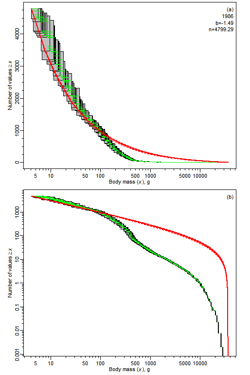

# sizeSpectra
R package for fitting size spectra to ecological data (including binned data)

 <!-- badges: start -->
  [](https://travis-ci.org/andrew-edwards/sizeSpectra)
  [](https://codecov.io/gh/andrew-edwards/sizeSpectra?branch=master)
  <!-- badges: end -->

In development - not usable yet (though is downloadable if it says 'build passing' above)

## Description
This R package contains functions for fitting size spectra to ecological data. In particular, it contains functionalised code to reproduce all the results in [1] and [2], and for users to apply the methods to their own data.

[1] **Testing and recommending methods for fitting size spectra to data** by Andrew M. Edwards, James P. W. Robinson, Michael J. Plank, Julia K. Baum and Julia L. Blanchard. ***Methods in Ecology and Evolution*** (2017, 8:57-67). Freely available at <http://onlinelibrary.wiley.com/doi/10.1111/2041-210X.12641/full>

[2] ....

The size spectrum of an ecological community characterizes how a property, such as abundance or biomass, varies with body size. Size spectra are often used as ecosystem indicators of marine systems. Past applications have included groundfish trawl surveys, visual surveys of fish in kelp forests and coral reefs, sediment samples of benthic invertebrates and satellite remote sensing of chlorophyll, as well as terrestrial systems. Various methods have been used to fit size spectra over the past decades, and in [1] we tested eight of them and recommend the use of maximum likelihood. In [2] we extended the likelihood method to properly account for the bin structure of data.

Here is a movie showing fits to 30 years of International Bottom Trawl Survey data fit and plotted using our new methods, where uncertainty due to the bin structure is properly accounted for (see [2] for full explanations):



The vignettes (TODO include links here, do an overview one) explain how to use the functions in the package to reproduce all results in both papers, and to analyse new data sets using our functions. The vignettes are descriptions of how to use the code to implement the methods. The two papers should be consulted first to understand the methods (I have tried to avoid repeating text from the papers in the vignettes). In the vignettes, [1] is referred to as the 'MEE paper' and [2] as the 'MEPS paper'.

## Install instructions

To install this package directly from GitHub you need the package `devtools`, so if you don't have it install it (once):

```
install.packages("devtools")
```

To install the latest version of `sizeSpectra`:
```
devtools::install_github("andrew-edwards/sizeSpectra", build_vignettes = TRUE)
```

(May take a minute or so while building the vignettes). Then:
```
library(sizeSpectra)
vignette("MEE_reproduce_1", package="sizeSpectra")
```
to see the first vignette in an html browser, and
```
browseVignettes("sizeSpectra")
```
to see the available ones.

TODO create overview vignette? Test browseVignettes...

TODO: Vignette instructions. Improve names of them.

## Issues, problems

Please report any problems as a [GitHub Issue](https://github.com/andrew-edwards/sizeSpectra/issues), using a minimal working example if possible (and please check the closed issues first).

Note that this code was written over several years, and then converted into a package. As such, I have not used consistent naming conventions (e.g. some column names are camelCase while others are not) like I would now if starting a package from scratch - these may be partly corrected.